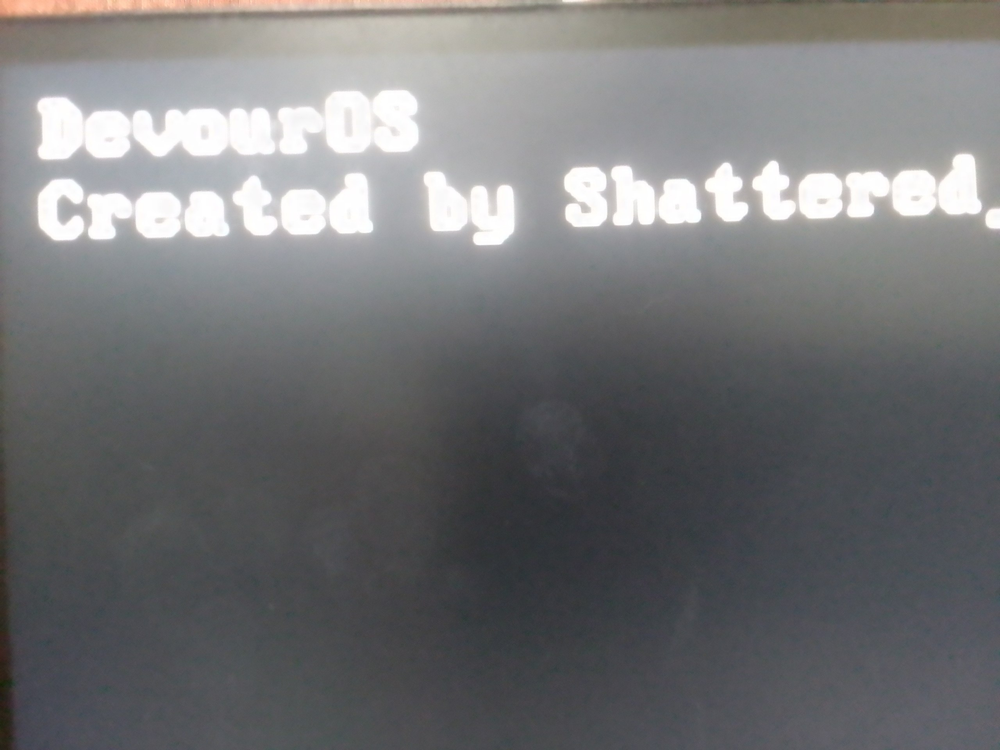

# DevourOS (Functional Bootloader)

## Features

✅ BIOS-compliant boot sector (512 bytes)  
✅ Bootable floppy disk image generation  
✅ QEMU and physical hardware support  
✅ Makefile-based build system

## Quick Start

### Prerequisites

- NASM
- QEMU
- GNU Make
- Mtools

### Build and Run

- `make`
  **Builds bootloader binary (bootloader.bin), kernel binary (kernel.bin), and floppy disk image (main_floppy.img).**

- `make clean`
  **Removes all build artifacts from build/ so you can do a fresh rebuild.**

- `qemu-system-x86_64 -fda build/main_floppy.img`
  **Launches the floppy disk image in QEMU, emulating a real PC.**

- `dd if=/dev/zero of=test.img bs=512 count=2880`
  **Creates an empty 1.44 MB floppy disk image (test.img) filled with zeros (used for experiments).**

- `mkfs.fat -F 12 -n "DVOS" test.img`
  **Formats test.img as a FAT12 filesystem and sets its volume label to DVOS.**

- `mcopy -i test.img build/kernel.bin "::kernel.bin"`
  **Copies the kernel binary into the root of the floppy disk image without mounting it.**

- `mdir -i build/main_floppy.img`
  **Lists the contents of the floppy disk image, allowing you to verify that files like kernel.bin are present.**

## Real Hardware Test

DevourOS has been successfully booted on **real hardware** in **Legacy BIOS.**

Below is a screenshot from my PC:

